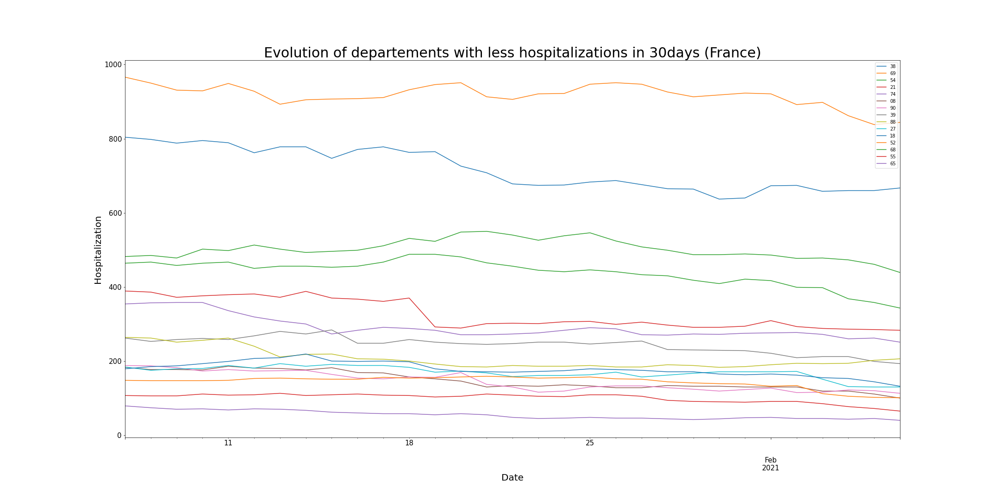
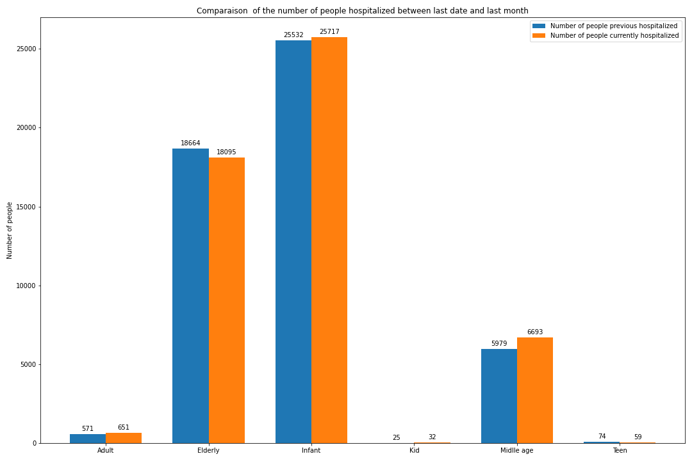
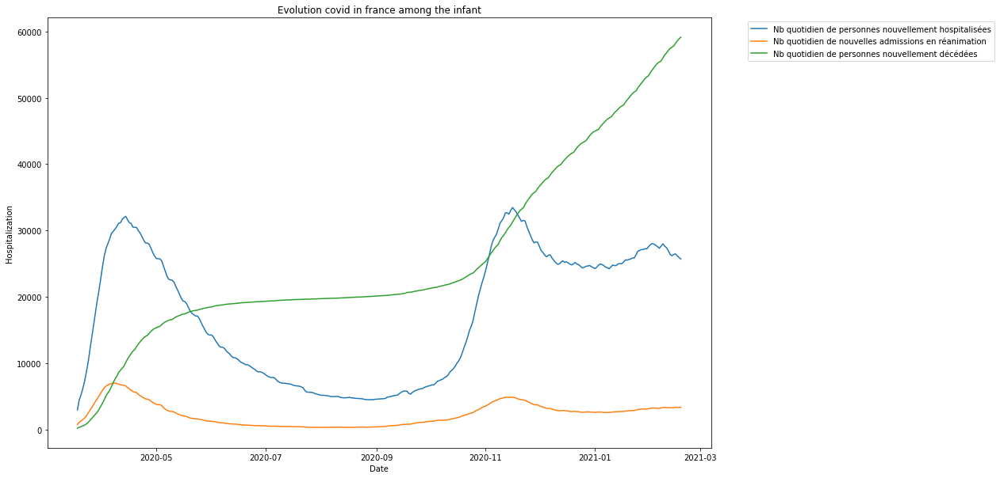
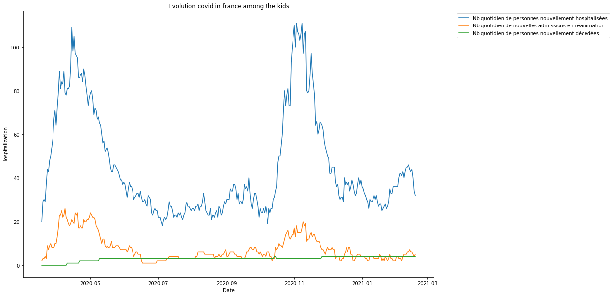
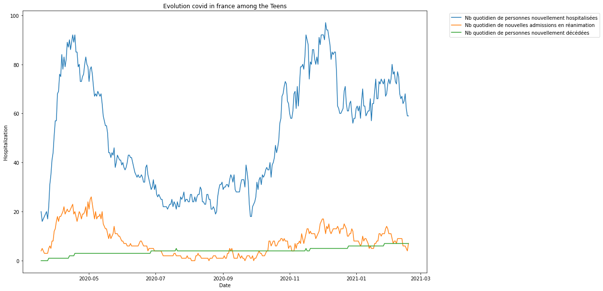
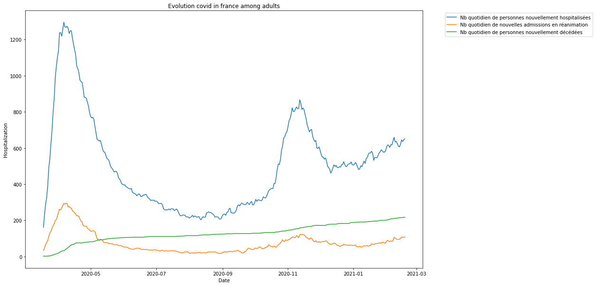
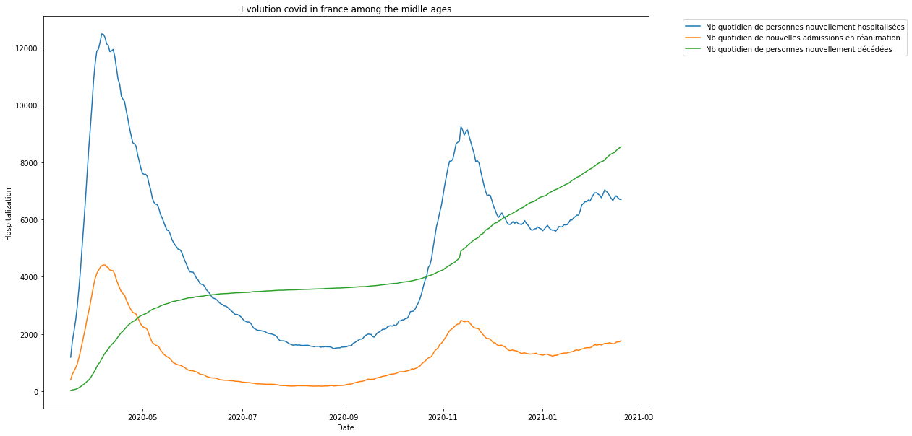

## Evolution of COVID in France by departement

[Can be tracked in this note](covid-par-dep.ipynb)

Used gouv database:
```
https://www.data.gouv.fr/fr/datasets/donnees-hospitalieres-relatives-a-lepidemie-de-covid-19/
```




## Evolution of COVID in France depending on age 

[Can be tracked in this note](covid-par-age.ipynb)




Infant : Less or equal to 1 years old 


Kid: between 2 and 9 years old


Teen: between 10 and 19 years old


Adult: between 20 and 39 years old


Midlle age: between 40 and 69


Elderly: More than 70 years old
